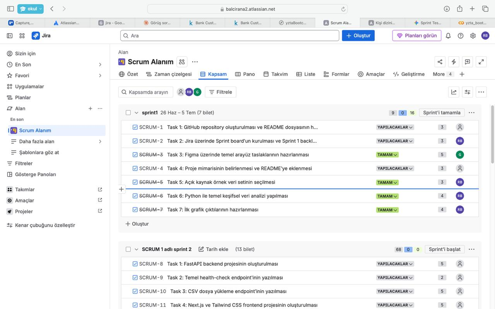
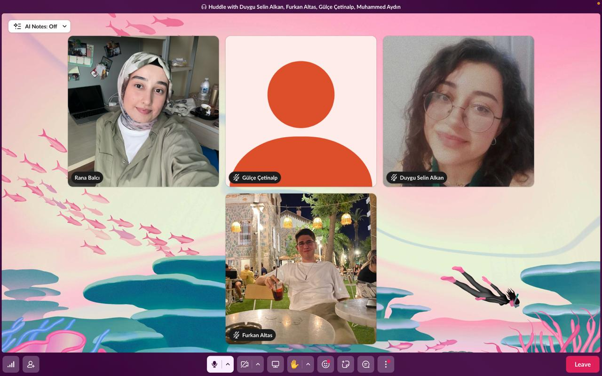
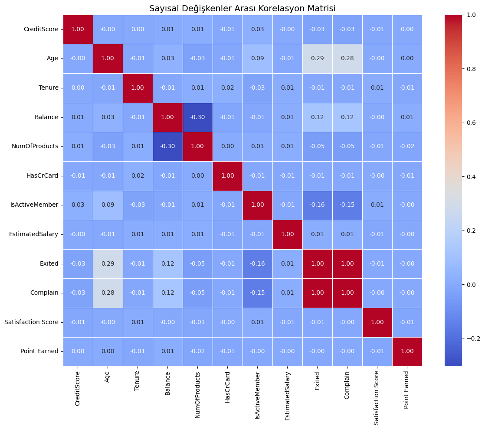
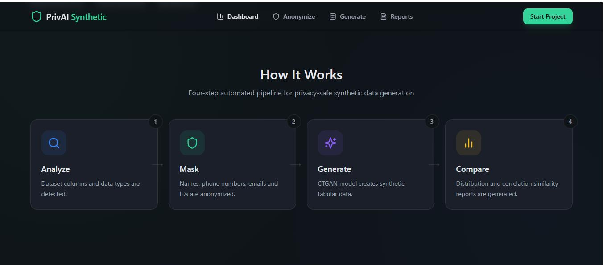
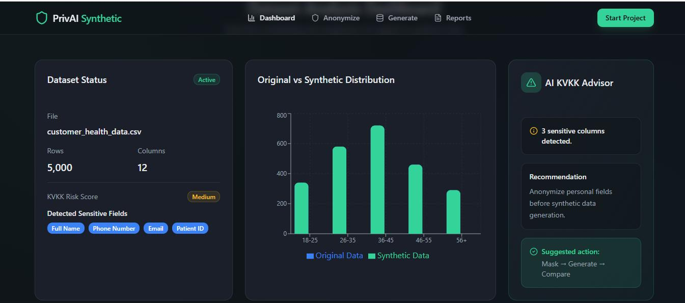
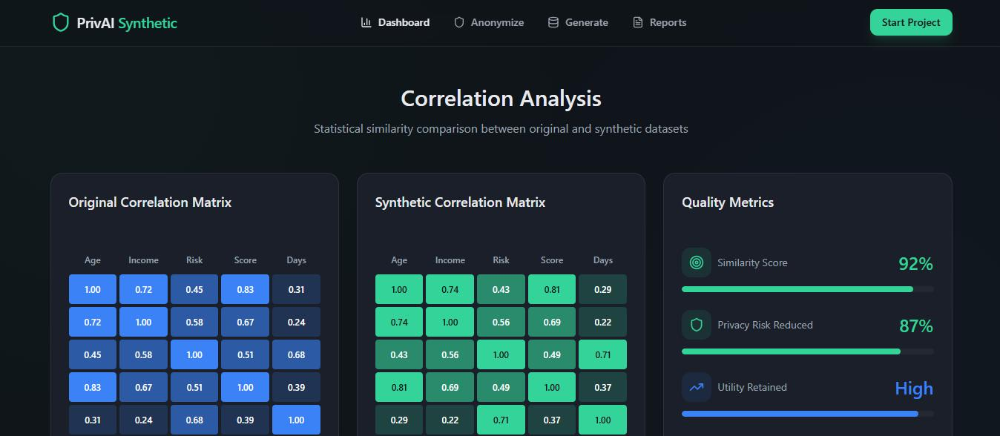

# AegisAI

Kullanıcıların yüklediği CSV veri setlerindeki hassas/kişisel verileri tespit edip anonimleştiren, bu veriye istatistiksel olarak benzeyen ama gerçek olmayan sentetik veri üreten ve bir AI agent'ın süreci analiz ederek teknik bir KVKK risk raporu yazdığı bir platform.

**Grup:** 85
**Bootcamp:** YZTA Bootcamp 2026 - 5. Akademi Dönemi (T3 Vakfı, Google, Sanayi ve Teknoloji Bakanlığı destekli)
**Sprint:** Sprint 1 (19 Haziran - 5 Temmuz 2026)

---

## 📋 Product Backlog

Proje sürecimizi **Jira** üzerinden takip ediyoruz.

**Açıklama:** Backlog'u Epic > Story > Task şeklinde yapılandırdık. Proje genelinde 9 Epic tanımlı: Project Management & Documentation, UI/UX Design, Frontend Development, FastAPI Backend, Data Analysis, Anonymization Service, Synthetic Data Generation, AI Agent & KVKK Risk Report, Testing/Deployment & Final Delivery. Sprint 1 kapsamında bu epic'lerden ilk üçüne ait 3 Story ve 7 Task board'a aktarıldı ve önceliklendirildi:
- **Story 1 — Proje Yönetimi ve Scrum Ortamının Hazırlanması** (GitHub repo + README, Jira Sprint board kurulumu)
- **Story 2 — Ürün Tasarımı ve Mimari Planlama** (Figma wireframe'leri, sistem mimarisinin belirlenmesi)
- **Story 3 — İlk Veri Analizi Çıktılarının Hazırlanması** (veri seti seçimi, EDA, ilk grafik çıktıları)

**Link:** https://balcirana2.atlassian.net/jira/software/projects/SCRUM/boards/1/backlog

**Ekran Görüntüsü:**

---

## 🎯 Sprint Puanlaması

**Puanlama mantığı:** Her Task'a karmaşıklığına göre 2-8 arası Story Point (SP) verdik. Basit görevler (repo/README kurulumu, board kurulumu, veri seti seçimi) 3 SP, orta karmaşıklıktaki görevler (EDA analizi, ilk grafik çıktıları) 4 SP, daha kapsamlı görevler (wireframe tasarımı, mimari planlama) 3-5 SP olarak puanlandı.

**Sprint 1 Toplam Story Point:** 25 SP

**Tamamlanan:** 25 SP / 25 SP (%100)

| Story | Planlanan SP | Tamamlanan SP |
|---|---|---|
| Story 1: Proje Yönetimi ve Scrum Ortamının Hazırlanması | 6 SP | 6 SP |
| Story 2: Ürün Tasarımı ve Mimari Planlama | 8 SP | 8 SP |
| Story 3: İlk Veri Analizi Çıktılarının Hazırlanması | 11 SP | 11 SP |
| **Toplam** | **25 SP** | **25 SP** |

---

## 💬 Daily Scrum

**Nasıl gerçekleştirdik:** Ekip üyelerinin programları farklı olduğu için daily scrum güncellemelerini her akşam saat 21:00 civarında Slack huddle (sesli/görüntülü toplantı) üzerinden yaptık. Her üye "dün ne yaptım / bugün ne yapacağım / önümde bir engel var mı" formatında güncelleme paylaştı.

**Ekran Görüntüsü:**

---

## 🖥️ Ürün Geliştirme Durumu

**Mevcut durum:** Sprint 1 sonunda Kaggle üzerinden seçilen Bank Customer Churn veri seti (10.000 satır, 18 sütun — `CreditScore`, `Geography`, `Gender`, `Age`, `Balance`, `NumOfProducts`, `Exited`, `Complain`, `Satisfaction Score`, `Point Earned` vb.) üzerinde Google Colab'da keşifsel veri analizi (EDA) tamamlandı. Veri setinde eksik değer bulunmuyor. Korelasyon matrisi ve 5 farklı dağılım grafiği (histogram, pasta, KDE, count plot, violin plot) üretildi. Ayrıca Figma üzerinde dashboard, anonimleştirme, sentetik veri karşılaştırma ve AI KVKK Advisor ekranlarının ilk mockup taslakları hazırlandı.

> **Not:** Mevcut mockup'lar henüz AegisAI'ye ve gerçek Bank Churn kolonlarına uyarlanmadı — "PrivAI Synthetic" adıyla ve genel bir `customer_health_data.csv` (Patient ID, Diagnosis gibi sağlık verisi alanları) senaryosuna göre tasarlandı. Sprint 2'de ürün adı ve gerçek veri seti kolonlarıyla güncellenecek.

**Ekran Görüntüleri:**

Korelasyon matrisi (EDA çıktısı):

UI mockup taslakları (isim/veri senaryosu güncellenecek, bkz. not yukarıda):

**Kısa açıklama:** Korelasyon matrisinde `Exited` ve `Complain` kolonları arasında tam 1.00 korelasyon görülüyor — bu, veri setinin bilinen bir tekrar/sızıntı (leakage) sorunu olup gerçek bir ilişkiyi göstermiyor; anonimleştirme ve risk skorlama mantığı kurulurken bu iki kolonun birbirinin kopyası olduğu göz önünde bulundurulacak. Ayrıca CreditScore dağılım histogramında ~840-850 aralığında ayrı bir bar olarak öne çıkan anormal bir yığılma (muhtemelen üst sınır/capping etkisi) tespit edildi; bu teknik gözlem Sprint 2'de anonimleştirme/sentetik veri modülleri geliştirilirken doğrulanacak ve ele alınacaktır.

---

## 🔍 Sprint Review

Sprint 1 boyunca şunları tamamladık:

- **Story 1 (Proje Yönetimi ve Scrum Ortamı):** GitHub repository ve ilk README dosyası hazırlandı; Jira üzerinde Scrum projesi, Epic/Story/Task yapısı ve Sprint 1 backlog'u kuruldu.
- **Story 2 (Ürün Tasarımı ve Mimari Planlama):** Veri Yükleme Ekranı, Analiz Sonuçları/Grafik Ekranı ve KVKK Risk Raporu Kartı için Figma wireframe taslakları hazırlandı. Sistem mimarisi netleştirildi: Next.js frontend, FastAPI backend, Python veri analizi modülü, anonimleştirme servisi, sentetik veri üretim servisi ve LangChain tabanlı KVKK Risk Analiz Ajanı.
- **Story 3 (İlk Veri Analizi Çıktıları):** Kaggle'dan Bank Customer Churn veri seti seçildi. Google Colab üzerinde ilk keşifsel veri analizi (EDA) yapıldı: veri boyutu ve eksik değer kontrolü, korelasyon matrisi, kredi skoru histogramı, churn oranı pasta grafiği, yaş dağılımı KDE grafiği, şikayet durumu count plot ve cinsiyete göre kredi skoru violin plot'u üretildi.

> Not: Mockup'lar henüz gerçek veri setine (Bank Churn kolonlarına) uyarlanmadı — bu Sprint 2'ye devrettiğimiz bir iş (bkz. Ürün Geliştirme Durumu bölümündeki not).

Aldığımız önemli kararlar:

- Ürünün ismi **AegisAI** olarak belirlendi.
- Sentetik veri üretimi için birincil yöntem CTGAN (SDV kütüphanesi), olası sorun durumunda yedek yöntem olarak Faker + istatistiksel kural tabanlı üretim kullanılacak.
- AI Agent (KVKK Risk Analiz Ajanı) tek adımlı bir "veri al, rapor yaz" akışı yerine çok adımlı muhakeme yapan bir yapıda (kolon analizi → risk skorlama → rapor yazma) kurulacak.

---

## 🔄 Sprint Retrospective

**İyi giden yönler:**

- Ürün ismi (AegisAI) ve sistem mimarisi hızlıca netleşti.
- Story 3 (veri seti seçimi + EDA) sprint içinde eksiksiz tamamlandı.
- Figma wireframe'leri erken aşamada hazırlandı.

**Geliştirilmesi gereken yönler:**

- UI mockup'lar gerçek veri setine (Bank Churn) ve ürün adına (AegisAI) göre tasarlanmadı, Sprint 2'ye ek iş olarak kaldı.
- Sprint'in büyük kısmı son günlerde yoğun şekilde ilerletildi; bu nedenle tamamlanan bazı işler (Task 1, 2, 4) Jira'da henüz "Tamam" olarak işaretlenmedi — board güncellenecek.

**Sprint 2 için planlanan değişiklikler:**

- Her ekip üyesinin backend/frontend/veri sorumluluğu Sprint 2 başında net şekilde belirlenecek.
- Görevlere sprint başında başlanacak, son güne bırakılmayacak.
- Sprint 2'nin iş yükü Sprint 1'e göre çok daha ağır olduğu için backend görevleri şu öncelik sırasıyla ilerletilecek: (1) FastAPI iskeleti ve CSV upload endpoint'i, (2) hassas veri tespiti ve anonimleştirme, (3) sentetik veri üretimi (CTGAN/SDV), (4) frontend-backend entegrasyonu, (5) AI Agent / deployment / dokümantasyon.
- UI mockup'ları AegisAI adına ve gerçek Bank Churn kolonlarına (CreditScore, Geography, Balance vb.) uyarlanacak.

---

## 🛠️ Teknoloji Yığını

- **Frontend:** Next.js, Tailwind CSS
- **Backend:** Python, FastAPI
- **Veri Analizi:** pandas, numpy, matplotlib, seaborn
- **Anonimleştirme:** Regex tabanlı tespit, kolon adı analizi, Presidio/SpaCy
- **Sentetik Veri Üretimi:** SDV / CTGAN (birincil), Faker + istatistiksel kural (yedek)
- **AI Agent:** LangChain, LLM entegrasyonu (çok adımlı KVKK Risk Analiz Ajanı)

## 👥 Takım Rolleri

| İsim | Rol |
|---|---|
| Rana Balcı | Product Owner |
| Gülçe Çetinalp | Scrum Master | 
| Duygu Selin Alkan | Developer |
| Furkan Altas | Developer |
| Muhammed Aydın | Developer |

