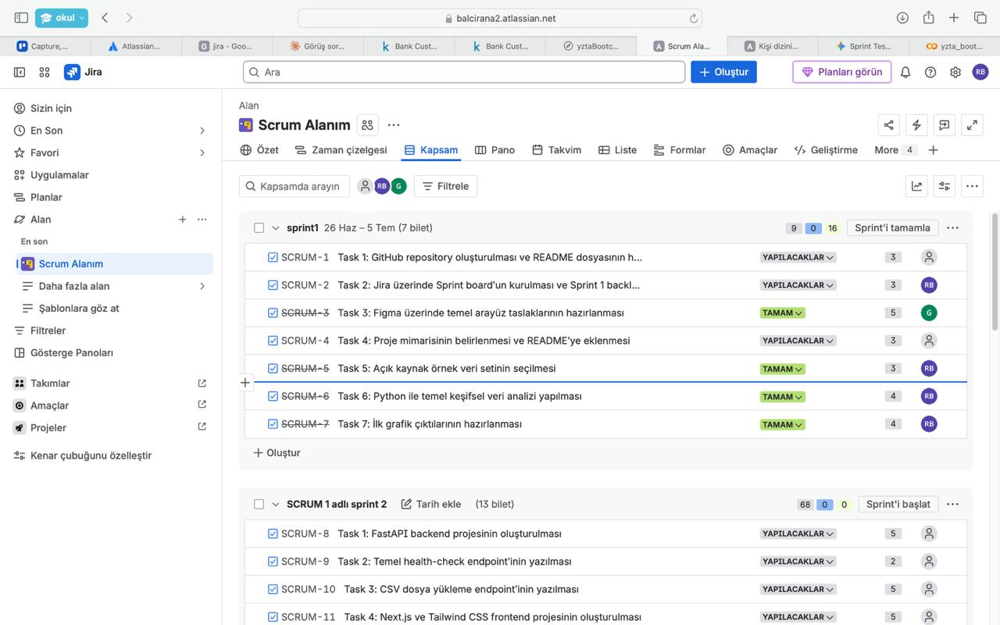
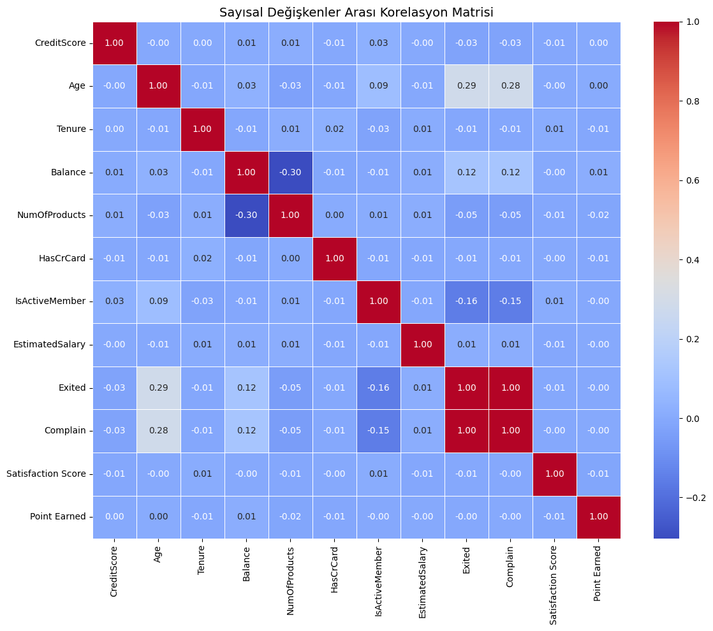
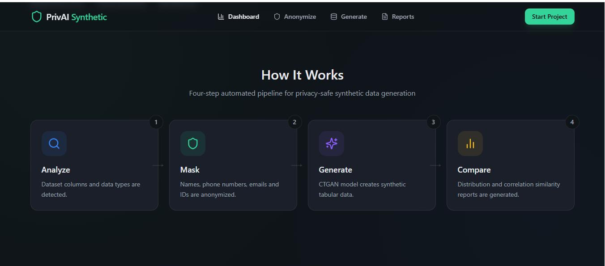
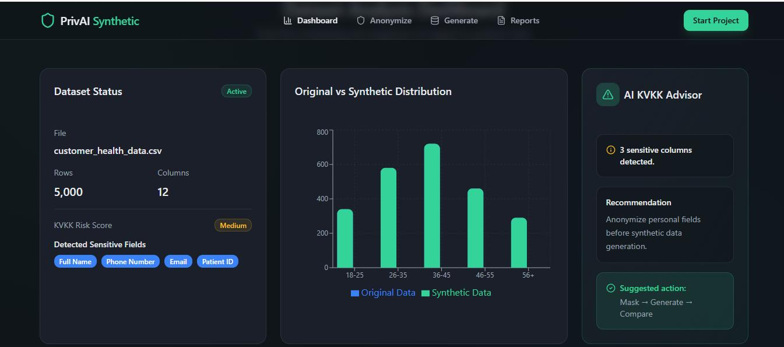
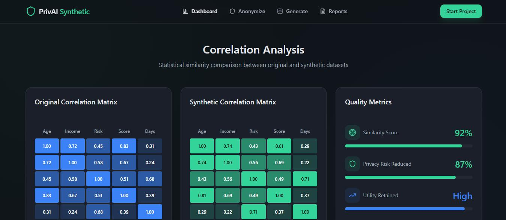
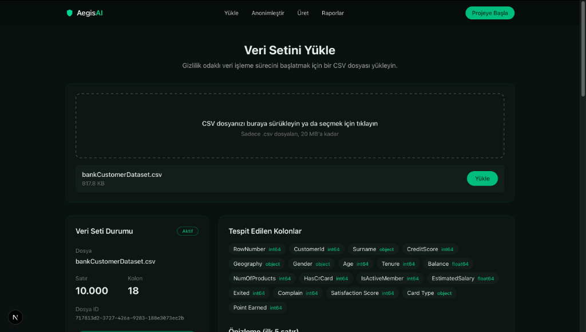
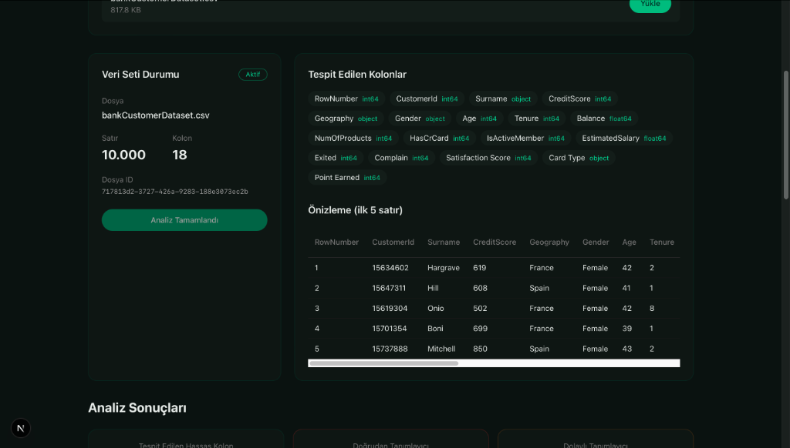
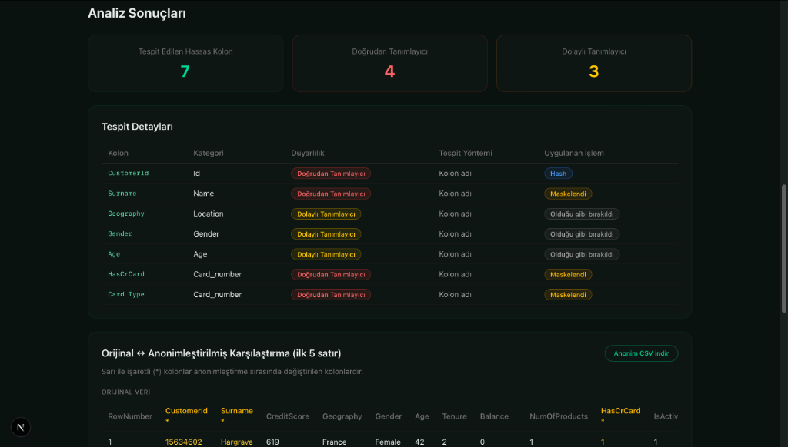
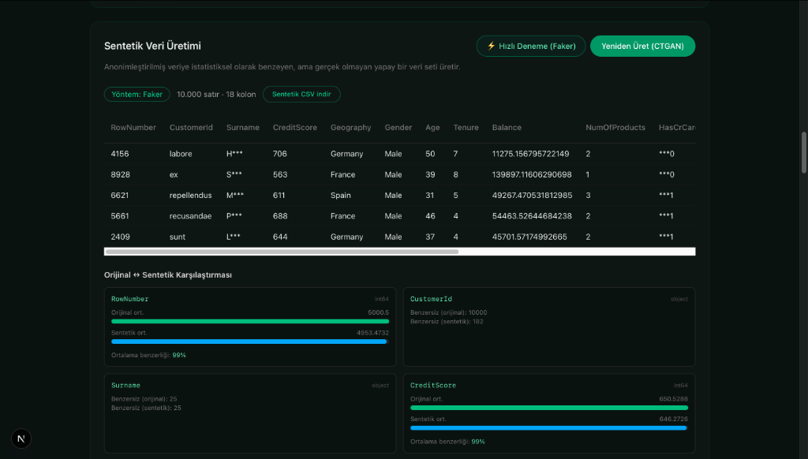
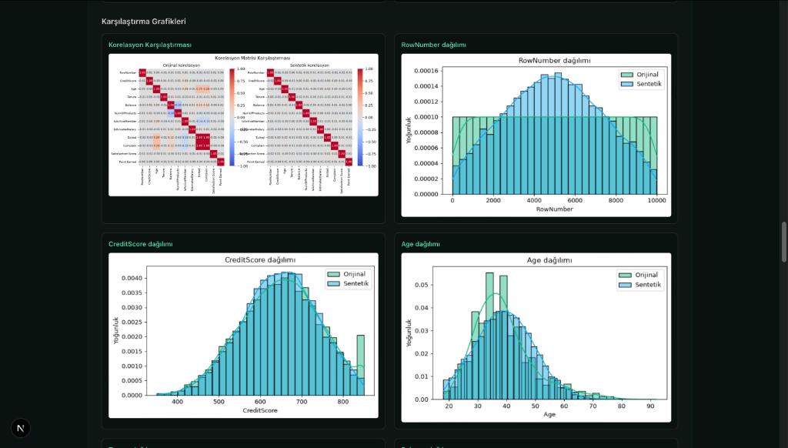

# AegisAI

Kullanıcıların yüklediği CSV veri setlerindeki hassas/kişisel verileri tespit edip anonimleştiren, bu veriye istatistiksel olarak benzeyen ama gerçek olmayan sentetik veri üreten ve bir AI agent'ın süreci analiz ederek teknik bir KVKK risk raporu yazdığı bir platform.

**Grup:** 85
**Bootcamp:** YZTA Bootcamp 2026 - 5. Akademi Dönemi (T3 Vakfı, Google, Sanayi ve Teknoloji Bakanlığı destekli)
**Tamamlanan Sprintler:** Sprint 1 (19 Haziran - 5 Temmuz 2026), Sprint 2 (13 Temmuz - 19 Temmuz 2026)

---

# Sprint 1 — Planlama, Tasarım ve Veri Analizi

## 📋 Product Backlog

Proje sürecimizi **Jira** üzerinden takip ediyoruz.

**Açıklama:** Backlog'u Epic > Story > Task şeklinde yapılandırdık. Proje genelinde 9 Epic tanımlı: Project Management & Documentation, UI/UX Design, Frontend Development, FastAPI Backend, Data Analysis, Anonymization Service, Synthetic Data Generation, AI Agent & KVKK Risk Report, Testing/Deployment & Final Delivery. Sprint 1 kapsamında bu epic'lerden ilk üçüne ait 3 Story ve 7 Task board'a aktarıldı ve önceliklendirildi:
- **Story 1 — Proje Yönetimi ve Scrum Ortamının Hazırlanması** (GitHub repo + README, Jira Sprint board kurulumu)
- **Story 2 — Ürün Tasarımı ve Mimari Planlama** (Figma wireframe'leri, sistem mimarisinin belirlenmesi)
- **Story 3 — İlk Veri Analizi Çıktılarının Hazırlanması** (veri seti seçimi, EDA, ilk grafik çıktıları)

**Link:** https://balcirana2.atlassian.net/jira/software/projects/SCRUM/boards/1/backlog

**Ekran Görüntüsü:**



---

## 🎯 Sprint Puanlaması

**Puanlama mantığı:** Her Task'a karmaşıklığına göre 2-8 arası Story Point (SP) verdik. Basit görevler (repo/README kurulumu, board kurulumu, veri seti seçimi) 3 SP, orta karmaşıklıktaki görevler (EDA analizi, ilk grafik çıktıları) 4 SP, daha kapsamlı görevler (wireframe tasarımı, mimari planlama) 3-5 SP olarak puanlandı.

**Sprint 1 Toplam Story Point:** 25 SP

**Tamamlanan:** 25 SP / 25 SP (%100)

| Story | Planlanan SP | Tamamlanan SP |
|---|---|---|
| Story 1: Proje Yönetimi ve Scrum Ortamının Hazırlanması | 6 SP | 6 SP |
| Story 2: Ürün Tasarımı ve Mimari Planlama | 8 SP | 8 SP |
| Story 3: İlk Veri Analizi Çıktılarının Hazırlanması | 11 SP | 11 SP |
| **Toplam** | **25 SP** | **25 SP** |

---

## 💬 Daily Scrum

**Nasıl gerçekleştirdik:** Ekip üyelerinin programları farklı olduğu için daily scrum güncellemelerini her akşam saat 21:00 civarında Slack huddle (sesli/görüntülü toplantı) üzerinden yaptık. Her üye "dün ne yaptım / bugün ne yapacağım / önümde bir engel var mı" formatında güncelleme paylaştı.

**Ekran Görüntüsü:**


---

## 🖥️ Ürün Geliştirme Durumu

**Mevcut durum:** Sprint 1 sonunda Kaggle üzerinden seçilen Bank Customer Churn veri seti (10.000 satır, 18 sütun — `CreditScore`, `Geography`, `Gender`, `Age`, `Balance`, `NumOfProducts`, `Exited`, `Complain`, `Satisfaction Score`, `Point Earned` vb.) üzerinde Google Colab'da keşifsel veri analizi (EDA) tamamlandı. Veri setinde eksik değer bulunmuyor. Korelasyon matrisi ve 5 farklı dağılım grafiği (histogram, pasta, KDE, count plot, violin plot) üretildi. Ayrıca Figma üzerinde dashboard, anonimleştirme, sentetik veri karşılaştırma ve AI KVKK Advisor ekranlarının ilk mockup taslakları hazırlandı.

> **Not:** Mevcut mockup'lar henüz AegisAI'ye ve gerçek Bank Churn kolonlarına uyarlanmadı — "PrivAI Synthetic" adıyla ve genel bir `customer_health_data.csv` (Patient ID, Diagnosis gibi sağlık verisi alanları) senaryosuna göre tasarlandı. Sprint 2'de ürün adı ve gerçek veri seti kolonlarıyla güncellenecek.

**Ekran Görüntüleri:**

Korelasyon matrisi (EDA çıktısı):



UI mockup taslakları (isim/veri senaryosu güncellenecek, bkz. not yukarıda):






**Kısa açıklama:** Korelasyon matrisinde `Exited` ve `Complain` kolonları arasında tam 1.00 korelasyon görülüyor — bu, veri setinin bilinen bir tekrar/sızıntı (leakage) sorunu olup gerçek bir ilişkiyi göstermiyor; anonimleştirme ve risk skorlama mantığı kurulurken bu iki kolonun birbirinin kopyası olduğu göz önünde bulundurulacak. Ayrıca CreditScore dağılım histogramında ~840-850 aralığında ayrı bir bar olarak öne çıkan anormal bir yığılma (muhtemelen üst sınır/capping etkisi) tespit edildi; bu teknik gözlem Sprint 2'de anonimleştirme/sentetik veri modülleri geliştirilirken doğrulanacak ve ele alınacaktır.

---

## 🔍 Sprint Review

Sprint 1 boyunca şunları tamamladık:

- **Story 1 (Proje Yönetimi ve Scrum Ortamı):** GitHub repository ve ilk README dosyası hazırlandı; Jira üzerinde Scrum projesi, Epic/Story/Task yapısı ve Sprint 1 backlog'u kuruldu.
- **Story 2 (Ürün Tasarımı ve Mimari Planlama):** Veri Yükleme Ekranı, Analiz Sonuçları/Grafik Ekranı ve KVKK Risk Raporu Kartı için Figma wireframe taslakları hazırlandı. Sistem mimarisi netleştirildi: Next.js frontend, FastAPI backend, Python veri analizi modülü, anonimleştirme servisi, sentetik veri üretim servisi ve LangChain tabanlı KVKK Risk Analiz Ajanı.
- **Story 3 (İlk Veri Analizi Çıktıları):** Kaggle'dan Bank Customer Churn veri seti seçildi. Google Colab üzerinde ilk keşifsel veri analizi (EDA) yapıldı: veri boyutu ve eksik değer kontrolü, korelasyon matrisi, kredi skoru histogramı, churn oranı pasta grafiği, yaş dağılımı KDE grafiği, şikayet durumu count plot ve cinsiyete göre kredi skoru violin plot'u üretildi.

> Not: Mockup'lar henüz gerçek veri setine (Bank Churn kolonlarına) uyarlanmadı — bu Sprint 2'ye devrettiğimiz bir iş (bkz. Ürün Geliştirme Durumu bölümündeki not).

Aldığımız önemli kararlar:

- Ürünün ismi **AegisAI** olarak belirlendi.
- Sentetik veri üretimi için birincil yöntem CTGAN (SDV kütüphanesi), olası sorun durumunda yedek yöntem olarak Faker + istatistiksel kural tabanlı üretim kullanılacak.
- AI Agent (KVKK Risk Analiz Ajanı) tek adımlı bir "veri al, rapor yaz" akışı yerine çok adımlı muhakeme yapan bir yapıda (kolon analizi → risk skorlama → rapor yazma) kurulacak.

---

## 🔄 Sprint Retrospective

**İyi giden yönler:**

- Ürün ismi (AegisAI) ve sistem mimarisi hızlıca netleşti.
- Story 3 (veri seti seçimi + EDA) sprint içinde eksiksiz tamamlandı.
- Figma wireframe'leri erken aşamada hazırlandı.

**Geliştirilmesi gereken yönler:**

- UI mockup'lar gerçek veri setine (Bank Churn) ve ürün adına (AegisAI) göre tasarlanmadı, Sprint 2'ye ek iş olarak kaldı.
- Sprint'in büyük kısmı son günlerde yoğun şekilde ilerletildi; bu nedenle tamamlanan bazı işler (Task 1, 2, 4) Jira'da henüz "Tamam" olarak işaretlenmedi — board güncellenecek.

**Sprint 2 için planlanan değişiklikler:**

- Her ekip üyesinin backend/frontend/veri sorumluluğu Sprint 2 başında net şekilde belirlenecek.
- Görevlere sprint başında başlanacak, son güne bırakılmayacak.
- Sprint 2'nin iş yükü Sprint 1'e göre çok daha ağır olduğu için backend görevleri şu öncelik sırasıyla ilerletilecek: (1) FastAPI iskeleti ve CSV upload endpoint'i, (2) hassas veri tespiti ve anonimleştirme, (3) sentetik veri üretimi (CTGAN/SDV), (4) frontend-backend entegrasyonu, (5) AI Agent / deployment / dokümantasyon.
- UI mockup'ları AegisAI adına ve gerçek Bank Churn kolonlarına (CreditScore, Geography, Balance vb.) uyarlanacak.

---

---

# Sprint 2 — Backend, Frontend ve Veri Güvenliği Akışı

**Sprint Tarihleri:** 13 Temmuz - 19 Temmuz 2026

## 📋 Sprint 2 Product Backlog

Sprint 2'nin temel hedefi, Sprint 1'de tasarlanan sistem mimarisini çalışan bir ürüne dönüştürmekti. Bu kapsamda FastAPI backend ve Next.js frontend projeleri oluşturuldu; CSV yükleme, hassas veri tespiti, anonimleştirme ve sentetik veri üretimi için gerekli servisler geliştirildi. Sprintin son aşamasında frontend ile backend bağlantısı kurularak analiz sonuçlarının kullanıcı arayüzünde gösterilmesi sağlandı.

Sprint 2 kapsamında aşağıdaki tasklar tamamlandı:

| No | Task | Story Point |
|---:|---|---:|
| 1 | FastAPI backend projesinin oluşturulması | 5 SP |
| 2 | Temel health-check endpoint'inin yazılması | 2 SP |
| 3 | CSV dosya yükleme endpoint'inin yazılması | 5 SP |
| 4 | Next.js ve Tailwind CSS frontend projesinin oluşturulması | 5 SP |
| 5 | CSV dosya yükleme arayüzünün kodlanması | 5 SP |
| 6 | Hassas veri tespit fonksiyonlarının yazılması | 8 SP |
| 7 | Hassas verilerin anonimleştirilmesi | 5 SP |
| 8 | Anonimleştirme endpoint'inin oluşturulması | 5 SP |
| 9 | SDV/CTGAN ile sentetik veri üretim denemesi yapılması | 8 SP |
| 10 | Alternatif sentetik veri üretim yönteminin hazırlanması | 5 SP |
| 11 | Sentetik veri üretim endpoint'inin oluşturulması | 5 SP |
| 12 | Frontend ile FastAPI backend bağlantısının kurulması | 5 SP |
| 13 | Backend'den dönen analiz sonucunun frontend'de gösterilmesi | 5 SP |
|  | **Toplam** | **68 SP** |

**Jira Backlog:** https://balcirana2.atlassian.net/jira/software/projects/SCRUM/boards/1/backlog

## 🎯 Sprint 2 Puanlaması

Tasklar; geliştirme kapsamı, teknik karmaşıklık, entegrasyon ihtiyacı ve beklenen iş yükü dikkate alınarak 2-8 arasında Story Point ile puanlandı. Health-check gibi sınırlı kapsamlı bir görev 2 SP olarak değerlendirilirken hassas veri tespiti ve CTGAN denemesi gibi araştırma ve geliştirme gerektiren görevler 8 SP olarak puanlandı.

**Sprint 2 Toplam Story Point:** 68 SP  
**Tamamlanan:** 68 SP / 68 SP (%100)  
**Sonraki sprinte devredilen:** 0 SP

| Çalışma Alanı | İlgili Tasklar | Planlanan SP | Tamamlanan SP |
|---|---|---:|---:|
| FastAPI backend ve CSV yükleme | Task 1-3 | 12 SP | 12 SP |
| Next.js frontend ve yükleme arayüzü | Task 4-5 | 10 SP | 10 SP |
| Hassas veri tespiti ve anonimleştirme | Task 6-8 | 18 SP | 18 SP |
| Sentetik veri üretimi | Task 9-11 | 18 SP | 18 SP |
| Frontend-backend entegrasyonu | Task 12-13 | 10 SP | 10 SP |
| **Toplam** | **Task 1-13** | **68 SP** | **68 SP** |

## 💬 Daily Scrum

Daily Scrum görüşmeleri Sprint 1'de olduğu gibi Slack üzerinden gerçekleştirildi. Ekip üyeleri tamamladıkları işleri, sıradaki görevlerini ve varsa karşılaştıkları engelleri paylaşarak backend, frontend ve veri işleme modülleri arasındaki koordinasyonu sürdürdü.

## 🖥️ Ürün Geliştirme Durumu

Sprint 2 sonunda projenin temel uçtan uca veri işleme akışı çalışır hâle getirildi. Kullanıcılar frontend üzerinden en fazla 20 MB boyutunda bir CSV dosyası yükleyebiliyor; sistem dosyanın satır ve sütun sayılarını, kolon adlarını, veri tiplerini ve ilk beş satırını döndürüyor.

Hassas veri tespit servisinde kolon adı analizi ile içerik tabanlı regex taraması birlikte kullanılıyor. Sistem; ad-soyad, kimlik numarası, müşteri ID'si, e-posta, telefon, adres, IBAN ve kart numarası gibi doğrudan tanımlayıcıların yanı sıra yaş, cinsiyet, konum ve doğum tarihi gibi dolaylı tanımlayıcıları da sınıflandırıyor. Doğrudan tanımlayıcı alanlar kategoriye göre SHA-256 tabanlı hashleme veya maskeleme ile anonimleştirilirken dolaylı tanımlayıcılar tespit raporunda belirtiliyor.

Sentetik veri üretimi için iki farklı yöntem hazırlandı. Birincil yöntemde SDV kütüphanesinin CTGAN modeli kullanılıyor. Alternatif yöntemde ise Faker ile istatistiksel ve kural tabanlı örnekleme birleştiriliyor. `auto` seçeneğinde önce CTGAN deneniyor; bu yöntemin kullanılamadığı durumlarda sistem otomatik olarak Faker tabanlı yönteme geçiyor. Üretilen sentetik veri yeni bir dosya kimliğiyle saklanıyor ve orijinal veriyle karşılaştırmalı özet istatistikler döndürülüyor.

Frontend, FastAPI backend ile bağlandı. CSV yükleme sonuçları ile hassas kolon tespitleri, uygulanan anonimleştirme işlemleri ve anonimleştirilmiş veri önizlemesi kullanıcı arayüzünde görüntülenebiliyor.

## 🔌 API Endpoint'leri

| Method | Endpoint | Açıklama |
|---|---|---|
| `GET` | `/health` | Backend servisinin çalışma durumunu kontrol eder. |
| `POST` | `/api/upload` | CSV dosyasını doğrular, kaydeder ve veri seti özetini döndürür. |
| `POST` | `/api/anonymize/{file_id}` | Hassas kolonları tespit eder ve anonimleştirilmiş veri setini oluşturur. |
| `POST` | `/api/synthetic/{file_id}` | `ctgan`, `faker` veya `auto` yöntemiyle sentetik veri üretir. |

Sentetik veri endpoint'i `method`, `num_rows` ve `epochs` sorgu parametrelerini destekler. Varsayılan `method=auto` seçeneği CTGAN başarısız olduğunda Faker tabanlı yöntemi kullanır.

## 🔍 Sprint 2 Review

Sprint 2 boyunca aşağıdaki çalışmalar tamamlandı:

- FastAPI uygulama iskeleti, CORS ayarları ve health-check endpoint'i oluşturuldu.
- CSV dosyaları için uzantı, boyut ve içerik doğrulamaları içeren yükleme endpoint'i geliştirildi.
- Next.js, TypeScript ve Tailwind CSS tabanlı frontend projesi oluşturuldu.
- Sürükle-bırak ve dosya seçme yöntemlerini destekleyen CSV yükleme arayüzü hazırlandı.
- Kolon adı ve içerik regex taramasını birleştiren hassas veri tespit servisi geliştirildi.
- Hassas alanlar için hashleme ve maskeleme stratejileri uygulandı.
- Anonimleştirilmiş veri setini ayrı bir dosya kimliğiyle kaydeden endpoint geliştirildi.
- SDV/CTGAN tabanlı sentetik veri üretim yöntemi hazırlandı.
- CTGAN'ın kullanılamadığı durumlar için Faker ve istatistiksel örnekleme tabanlı alternatif yöntem geliştirildi.
- Sentetik veri üretimini tek endpoint üzerinden sunan `ctgan`, `faker` ve `auto` seçenekleri oluşturuldu.
- Frontend ile FastAPI backend arasında bağlantı kuruldu.
- Veri seti özeti, hassas veri tespitleri, anonimleştirme aksiyonları ve anonim veri önizlemesi frontend'de gösterildi.

Sprint için planlanan 13 taskın tamamı bitirildi ve sonraki sprinte iş devredilmedi.

## 🔄 Sprint 2 Retrospective

**İyi giden yönler:**

- Sprint 2 için planlanan 13 taskın tamamı sprint süresi içerisinde tamamlandı.
- Backend, frontend, anonimleştirme ve sentetik veri üretim modülleri aynı veri akışı altında birleştirildi.
- Slack üzerinden sürdürülen iletişim, farklı modüller üzerinde çalışan ekip üyeleri arasındaki koordinasyonu destekledi.
- Planlanan 68 Story Point'in tamamlanmasıyla sprint hedefine ulaşıldı.
- CTGAN'ın kullanılamadığı durumlar düşünülerek alternatif bir sentetik veri üretim yöntemi hazırlanması sistemin dayanıklılığını artırdı.

**Geliştirilmesi gereken yönler:**

- Sprint boyunca ekip tarafından bildirilen kritik bir engel bulunmadı.
- Modüllerin kapsamı genişledikçe entegrasyon ve test süreçlerinin daha sistematik biçimde belgelenmesi gerektiği görüldü.
- Sonraki sprintte uçtan uca testlere, hata senaryolarına ve kullanıcı deneyiminin iyileştirilmesine daha fazla zaman ayrılması planlandı.

**Sonraki sprint için öngörülen çalışmalar:**

- Uçtan uca testlerin ve hata senaryolarının genişletilmesi
- Frontend'de sentetik veri üretim akışının ve karşılaştırmalı sonuçların geliştirilmesi
- Çok adımlı KVKK Risk Analiz Ajanı'nın sisteme entegre edilmesi
- Son kullanıcı arayüzünün iyileştirilmesi
- Deployment ve final ürün dokümantasyonunun hazırlanması

---

# Sprint 3 — Final Teslimat, AI Agent & Kullanıcı Deneyimi

## 📋 Product Backlog & Tamamlanan Story'ler

Sprint 3 kapsamında ürünün son hali tamamlandı, AI Agent KVKK raporlama modülü entegre edildi ve arayüz dinamik hale getirildi:
- **Story 1 — KVKK Risk Analiz Ajanı Entegrasyonu:** LangChain ve çok adımlı orkestrasyon (Kolon Analizi -> Risk Skorlama -> Teknik Rapor Oluşturma).
- **Story 2 — Gelişmiş Sentetik Veri & Karşılaştırmalı Grafikler:** CTGAN ve hızlı Faker modelleri ile üretilen verilerin korelasyon ve dağılım grafiklerinin (base64) sunulması.
- **Story 3 — Kullanıcı Arayüzü & Akıcı Navigasyon:** Smooth-scroll dinamik üst menü, canlı karşılaştırma tabloları, responsive dark theme tasarım.

---

## 🖼️ Proje Ekran Görüntüleri (AegisAI Arayüzü)

### 1. Veri Seti Yükleme Ekranı
Sürükle-bırak ve dosya gezgini desteği sunan CSV yükleme alanı ve otomatik kolon/satır tespiti:



---

### 2. Veri Seti Durumu ve Önizleme
Yüklenen CSV dosyasının veri yapısı, kolon tipleri ve ilk 5 satırlık canlı önizleme tablosu:



---

### 3. Hassas Veri Tespiti ve Anonimleştirme Karşılaştırması
Doğrudan ve dolaylı tanımlayıcıların tespiti, uygulanan Hash/Maskeleme işlemleri ve Orijinal ↔ Anonimleştirilmiş veri karşılaştırması:



---

### 4. Sentetik Veri Üretimi ve İstatistiksel Karşılaştırma
CTGAN ve Hızlı Faker modelleri ile üretilen yapay verinin orijinal veri ortalamalarıyla kıyaslanması:



---

### 5. Karşılaştırma Grafikleri (Korelasyon & Dağılım)
Matplotlib ve Seaborn ile dinamik olarak üretilen Korelasyon Matrisi Karşılaştırması ve Değişken Dağılım Grafikleri:



---

## 🛠️ Teknoloji Yığını

- **Frontend:** Next.js (App Router), TypeScript, Tailwind CSS
- **Backend:** Python 3.13, FastAPI, Uvicorn
- **Veri Analizi & Görselleştirme:** pandas, numpy, matplotlib, seaborn
- **Hassas Veri Tespiti:** Regex tabanlı içerik taraması, Türkçe/İngilizce kolon adı analizi
- **Anonimleştirme:** SHA-256 tabanlı hashleme, kategori bazlı veri maskeleme (Masked / Hashed / Kept)
- **Sentetik Veri Üretimi:** SDV / CTGAN (Derin Öğrenme), Faker + İstatistiksel Örnekleme (Hızlı Mod)
- **AI Agent:** LangChain, LLM Entegrasyonu, Çok adımlı KVKK Risk Analiz Ajanı

---

## 🚀 Kurulum ve Çalıştırma

### Backend

```bash
cd backend
python -m venv .venv
```

Sanal ortamı etkinleştirin:

```bash
# Windows
.venv\Scripts\activate

# macOS / Linux
source .venv/bin/activate
```

Bağımlılıkları kurup backend'i çalıştırın:

```bash
pip install -r requirements.txt
uvicorn app.main:app --port 8000
```

- **Backend:** http://localhost:8000
- **Swagger API Dokümantasyonu:** http://localhost:8000/docs
- **Health Check:** http://localhost:8000/health

### Frontend

Yeni bir terminalde:

```bash
cd frontend
npm install
npm run dev
```

Frontend http://localhost:3000 adresinde açılır.

---

## 📁 Proje Yapısı

```text
YZTE_Bootcamp/
├── backend/
│   ├── app/
│   │   ├── routers/        # Upload, anonymize, synthetic, report ve health endpoint'leri
│   │   ├── services/       # Tespit, anonimleştirme, CTGAN, Faker ve AI Agent servisleri
│   │   ├── main.py         # FastAPI uygulaması ve CORS yapılandırması
│   │   └── storage.py      # CSV dosyalarının yerel depolama yönetimi
│   ├── scripts/            # Otomatik smoke testleri
│   ├── uploads/            # İşlenen CSV ve rapor dosyaları
│   └── requirements.txt
├── frontend/
│   ├── src/app/            # Next.js arayüzü (layout.tsx, page.tsx, globals.css)
│   ├── src/lib/api.ts      # Backend API entegrasyonu (Fetch client)
│   └── package.json
├── gorseller/              # Proje ekran görüntüleri, Jira ve Scrum dokümanları
├── yzta_bootcamp.ipynb     # Keşifsel Veri Analizi (EDA) çalışmaları
└── README.md
```

---

## 👥 Takım Rolleri

| İsim | Rol |
|---|---|
| Rana Balcı | Product Owner |
| Gülçe Çetinalp | Scrum Master | 
| Duygu Selin Alkan | Developer |
| Furkan Altas | Developer |
| Muhammed Aydın | Developer |

